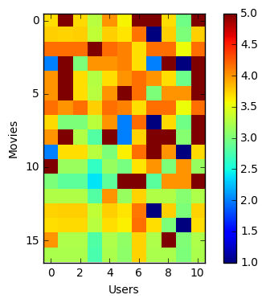
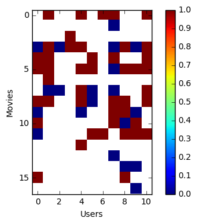
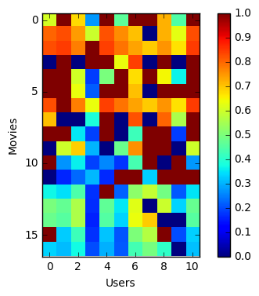

```python
import numpy as np
import matplotlib.pyplot as plt
from scipy.stats import norm
from keras.layers import Input, Dense, Lambda, multiply, concatenate, add
from keras.models import Model
from keras import backend as K
from keras import objectives
from keras import optimizers
from keras.datasets import mnist
import pandas as pd
import tensorflow as tf
```

    /Users/semihakbayrak/anaconda/lib/python2.7/site-packages/matplotlib/font_manager.py:273: UserWarning: Matplotlib is building the font cache using fc-list. This may take a moment.
      warnings.warn('Matplotlib is building the font cache using fc-list. This may take a moment.')
    Using TensorFlow backend.


```python
# Initialize Keras with Tensorflow session
sess = tf.Session()
K.set_session(sess)
```


```python
rnames = ['user_id', 'movie_id', 'rating', 'timestamp']
ratings = pd.read_table('u.data', sep='\t', header=None, names=rnames)
ratings
```


<div>
<table border="1" class="dataframe">
  <thead>
    <tr style="text-align: right;">
      <th></th>
      <th>user_id</th>
      <th>movie_id</th>
      <th>rating</th>
      <th>timestamp</th>
    </tr>
  </thead>
  <tbody>
    <tr>
      <th>0</th>
      <td>196</td>
      <td>242</td>
      <td>3</td>
      <td>881250949</td>
    </tr>
    <tr>
      <th>1</th>
      <td>186</td>
      <td>302</td>
      <td>3</td>
      <td>891717742</td>
    </tr>
    <tr>
      <th>2</th>
      <td>22</td>
      <td>377</td>
      <td>1</td>
      <td>878887116</td>
    </tr>
    <tr>
      <th>3</th>
      <td>244</td>
      <td>51</td>
      <td>2</td>
      <td>880606923</td>
    </tr>
    <tr>
      <th>4</th>
      <td>166</td>
      <td>346</td>
      <td>1</td>
      <td>886397596</td>
    </tr>
    <tr>
      <th>5</th>
      <td>298</td>
      <td>474</td>
      <td>4</td>
      <td>884182806</td>
    </tr>
    <tr>
      <th>6</th>
      <td>115</td>
      <td>265</td>
      <td>2</td>
      <td>881171488</td>
    </tr>
    <tr>
      <th>7</th>
      <td>253</td>
      <td>465</td>
      <td>5</td>
      <td>891628467</td>
    </tr>
    <tr>
      <th>8</th>
      <td>305</td>
      <td>451</td>
      <td>3</td>
      <td>886324817</td>
    </tr>
    <tr>
      <th>9</th>
      <td>6</td>
      <td>86</td>
      <td>3</td>
      <td>883603013</td>
    </tr>
    <tr>
      <th>10</th>
      <td>62</td>
      <td>257</td>
      <td>2</td>
      <td>879372434</td>
    </tr>
    <tr>
      <th>11</th>
      <td>286</td>
      <td>1014</td>
      <td>5</td>
      <td>879781125</td>
    </tr>
    <tr>
      <th>12</th>
      <td>200</td>
      <td>222</td>
      <td>5</td>
      <td>876042340</td>
    </tr>
    <tr>
      <th>13</th>
      <td>210</td>
      <td>40</td>
      <td>3</td>
      <td>891035994</td>
    </tr>
    <tr>
      <th>14</th>
      <td>224</td>
      <td>29</td>
      <td>3</td>
      <td>888104457</td>
    </tr>
    <tr>
      <th>15</th>
      <td>303</td>
      <td>785</td>
      <td>3</td>
      <td>879485318</td>
    </tr>
    <tr>
      <th>16</th>
      <td>122</td>
      <td>387</td>
      <td>5</td>
      <td>879270459</td>
    </tr>
    <tr>
      <th>17</th>
      <td>194</td>
      <td>274</td>
      <td>2</td>
      <td>879539794</td>
    </tr>
    <tr>
      <th>18</th>
      <td>291</td>
      <td>1042</td>
      <td>4</td>
      <td>874834944</td>
    </tr>
    <tr>
      <th>19</th>
      <td>234</td>
      <td>1184</td>
      <td>2</td>
      <td>892079237</td>
    </tr>
    <tr>
      <th>20</th>
      <td>119</td>
      <td>392</td>
      <td>4</td>
      <td>886176814</td>
    </tr>
    <tr>
      <th>21</th>
      <td>167</td>
      <td>486</td>
      <td>4</td>
      <td>892738452</td>
    </tr>
    <tr>
      <th>22</th>
      <td>299</td>
      <td>144</td>
      <td>4</td>
      <td>877881320</td>
    </tr>
    <tr>
      <th>23</th>
      <td>291</td>
      <td>118</td>
      <td>2</td>
      <td>874833878</td>
    </tr>
    <tr>
      <th>24</th>
      <td>308</td>
      <td>1</td>
      <td>4</td>
      <td>887736532</td>
    </tr>
    <tr>
      <th>25</th>
      <td>95</td>
      <td>546</td>
      <td>2</td>
      <td>879196566</td>
    </tr>
    <tr>
      <th>26</th>
      <td>38</td>
      <td>95</td>
      <td>5</td>
      <td>892430094</td>
    </tr>
    <tr>
      <th>27</th>
      <td>102</td>
      <td>768</td>
      <td>2</td>
      <td>883748450</td>
    </tr>
    <tr>
      <th>28</th>
      <td>63</td>
      <td>277</td>
      <td>4</td>
      <td>875747401</td>
    </tr>
    <tr>
      <th>29</th>
      <td>160</td>
      <td>234</td>
      <td>5</td>
      <td>876861185</td>
    </tr>
    <tr>
      <th>...</th>
      <td>...</td>
      <td>...</td>
      <td>...</td>
      <td>...</td>
    </tr>
    <tr>
      <th>99970</th>
      <td>449</td>
      <td>120</td>
      <td>1</td>
      <td>879959573</td>
    </tr>
    <tr>
      <th>99971</th>
      <td>661</td>
      <td>762</td>
      <td>2</td>
      <td>876037121</td>
    </tr>
    <tr>
      <th>99972</th>
      <td>721</td>
      <td>874</td>
      <td>3</td>
      <td>877137447</td>
    </tr>
    <tr>
      <th>99973</th>
      <td>821</td>
      <td>151</td>
      <td>4</td>
      <td>874792889</td>
    </tr>
    <tr>
      <th>99974</th>
      <td>764</td>
      <td>596</td>
      <td>3</td>
      <td>876243046</td>
    </tr>
    <tr>
      <th>99975</th>
      <td>537</td>
      <td>443</td>
      <td>3</td>
      <td>886031752</td>
    </tr>
    <tr>
      <th>99976</th>
      <td>618</td>
      <td>628</td>
      <td>2</td>
      <td>891308019</td>
    </tr>
    <tr>
      <th>99977</th>
      <td>487</td>
      <td>291</td>
      <td>3</td>
      <td>883445079</td>
    </tr>
    <tr>
      <th>99978</th>
      <td>113</td>
      <td>975</td>
      <td>5</td>
      <td>875936424</td>
    </tr>
    <tr>
      <th>99979</th>
      <td>943</td>
      <td>391</td>
      <td>2</td>
      <td>888640291</td>
    </tr>
    <tr>
      <th>99980</th>
      <td>864</td>
      <td>685</td>
      <td>4</td>
      <td>888891900</td>
    </tr>
    <tr>
      <th>99981</th>
      <td>750</td>
      <td>323</td>
      <td>3</td>
      <td>879445877</td>
    </tr>
    <tr>
      <th>99982</th>
      <td>279</td>
      <td>64</td>
      <td>1</td>
      <td>875308510</td>
    </tr>
    <tr>
      <th>99983</th>
      <td>646</td>
      <td>750</td>
      <td>3</td>
      <td>888528902</td>
    </tr>
    <tr>
      <th>99984</th>
      <td>654</td>
      <td>370</td>
      <td>2</td>
      <td>887863914</td>
    </tr>
    <tr>
      <th>99985</th>
      <td>617</td>
      <td>582</td>
      <td>4</td>
      <td>883789294</td>
    </tr>
    <tr>
      <th>99986</th>
      <td>913</td>
      <td>690</td>
      <td>3</td>
      <td>880824288</td>
    </tr>
    <tr>
      <th>99987</th>
      <td>660</td>
      <td>229</td>
      <td>2</td>
      <td>891406212</td>
    </tr>
    <tr>
      <th>99988</th>
      <td>421</td>
      <td>498</td>
      <td>4</td>
      <td>892241344</td>
    </tr>
    <tr>
      <th>99989</th>
      <td>495</td>
      <td>1091</td>
      <td>4</td>
      <td>888637503</td>
    </tr>
    <tr>
      <th>99990</th>
      <td>806</td>
      <td>421</td>
      <td>4</td>
      <td>882388897</td>
    </tr>
    <tr>
      <th>99991</th>
      <td>676</td>
      <td>538</td>
      <td>4</td>
      <td>892685437</td>
    </tr>
    <tr>
      <th>99992</th>
      <td>721</td>
      <td>262</td>
      <td>3</td>
      <td>877137285</td>
    </tr>
    <tr>
      <th>99993</th>
      <td>913</td>
      <td>209</td>
      <td>2</td>
      <td>881367150</td>
    </tr>
    <tr>
      <th>99994</th>
      <td>378</td>
      <td>78</td>
      <td>3</td>
      <td>880056976</td>
    </tr>
    <tr>
      <th>99995</th>
      <td>880</td>
      <td>476</td>
      <td>3</td>
      <td>880175444</td>
    </tr>
    <tr>
      <th>99996</th>
      <td>716</td>
      <td>204</td>
      <td>5</td>
      <td>879795543</td>
    </tr>
    <tr>
      <th>99997</th>
      <td>276</td>
      <td>1090</td>
      <td>1</td>
      <td>874795795</td>
    </tr>
    <tr>
      <th>99998</th>
      <td>13</td>
      <td>225</td>
      <td>2</td>
      <td>882399156</td>
    </tr>
    <tr>
      <th>99999</th>
      <td>12</td>
      <td>203</td>
      <td>3</td>
      <td>879959583</td>
    </tr>
  </tbody>
</table>
<p>100000 rows × 4 columns</p>
</div>


# Gaussian Link Function


```python
M = max(ratings['movie_id']) #Number of rows
N = max(ratings['user_id']) #Number of columns

R = np.nan*np.ones((M,N)) #datamatrix

for k in range(len(ratings)):
    i = ratings['movie_id'][k] - 1
    j = ratings['user_id'][k] - 1
    #transform original ratings to binary ratings
    r = ratings['rating'][k]
    R[i,j] = r

print R
```

    [[  5.   4.  nan ...,   5.  nan  nan]
     [  3.  nan  nan ...,  nan  nan   5.]
     [  4.  nan  nan ...,  nan  nan  nan]
     ..., 
     [ nan  nan  nan ...,  nan  nan  nan]
     [ nan  nan  nan ...,  nan  nan  nan]
     [ nan  nan  nan ...,  nan  nan  nan]]


```python
Data = R[3:20,5:16] #Sample from original data matrix

plt.imshow(Data, interpolation='nearest',vmax=5,vmin=1)
plt.colorbar()
plt.set_cmap('jet')
plt.xlabel('Users')
plt.ylabel('Movies')
plt.show()
```


```python
#batch_size = len(ratings)
batch_size = 50
movie_in_dim = N
user_in_dim = M
latent_dim = 20
intermediate_dim = 125
semi_final_dim = 40
final_dim = 1
nb_epoch = 10
epsilon_std = 1.0
```


```python
#encoder
x_m = Input(batch_shape=(batch_size, movie_in_dim))
x_u = Input(batch_shape=(batch_size, user_in_dim))
z_mean_m = Dense(latent_dim, activation='tanh')(x_m)
z_log_var_m = Dense(latent_dim, activation='tanh')(x_m)
z_mean_u = Dense(latent_dim, activation='tanh')(x_u)
z_log_var_u = Dense(latent_dim, activation='tanh')(x_u)
```


```python
def sampling(args):
    z_mean, z_log_var = args
    epsilon = K.random_normal(shape=(batch_size, latent_dim), mean=0.)
    return z_mean + K.exp(z_log_var / 2) * epsilon

z_m = Lambda(sampling, output_shape=(latent_dim,))([z_mean_m, z_log_var_m])
z_u = Lambda(sampling, output_shape=(latent_dim,))([z_mean_u, z_log_var_u])
```


```python
#decoder
def inner_mult(args):
    z_m,z_u = args
    return tf.multiply(z_m,z_u)
    
z = Lambda(inner_mult,output_shape=(latent_dim,))([z_m, z_u])
print z

decoder_h = Dense(semi_final_dim, activation='tanh')
decoder_mean = Dense(final_dim)
h_decoded = decoder_h(z)
x_decoded_mean = decoder_mean(h_decoded)
print x_decoded_mean
```

    Tensor("lambda_3/Mul:0", shape=(50, 20), dtype=float32)
    Tensor("dense_6/BiasAdd:0", shape=(50, 1), dtype=float32)


```python
#loss
def vae_loss(y, x_decoded_mean):
    xent_loss = objectives.mean_squared_error(y, x_decoded_mean)
    kl_loss = - 0.5 * K.mean(1 + z_log_var_m - K.square(z_mean_m) - K.exp(z_log_var_m), axis=-1) - 0.5 * K.mean(1 + z_log_var_u - K.square(z_mean_u) - K.exp(z_log_var_u), axis=-1)
    return xent_loss + kl_loss

vae = Model([x_m,x_u], x_decoded_mean)
vae.compile(optimizer='rmsprop', loss=vae_loss)
```


```python
X = np.zeros((M,N)) #datamatrix

for k in range(len(ratings)):
    i = ratings['movie_id'][k] - 1
    j = ratings['user_id'][k] - 1
    #transform original ratings to binary ratings
    r = ratings['rating'][k]
    X[i,j] = r

print X
```

    [[ 5.  4.  0. ...,  5.  0.  0.]
     [ 3.  0.  0. ...,  0.  0.  5.]
     [ 4.  0.  0. ...,  0.  0.  0.]
     ..., 
     [ 0.  0.  0. ...,  0.  0.  0.]
     [ 0.  0.  0. ...,  0.  0.  0.]
     [ 0.  0.  0. ...,  0.  0.  0.]]


```python
X_m = np.zeros((len(ratings),N)) #datamatrix
X_u = np.zeros((len(ratings),M)) #datamatrix
y = np.zeros((len(ratings),1))

for k in range(len(ratings)):
    i = ratings['movie_id'][k] - 1
    j = ratings['user_id'][k] - 1
    #transform original ratings to binary ratings
    r = ratings['rating'][k]
    #X[i,j] = r
    X_m[k] = X[i,:]
    X_u[k] = X[:,j]
    y[k] = r

print X_m
print X_u
print y
```

    [[ 5.  5.  0. ...,  0.  0.  0.]
     [ 0.  5.  2. ...,  0.  0.  0.]
     [ 0.  0.  0. ...,  0.  0.  0.]
     ..., 
     [ 0.  0.  0. ...,  0.  0.  0.]
     [ 2.  0.  0. ...,  0.  0.  0.]
     [ 4.  0.  0. ...,  0.  0.  0.]]
    [[ 0.  0.  0. ...,  0.  0.  0.]
     [ 0.  0.  0. ...,  0.  0.  0.]
     [ 0.  2.  0. ...,  0.  0.  0.]
     ..., 
     [ 5.  4.  3. ...,  0.  0.  0.]
     [ 3.  3.  0. ...,  0.  0.  0.]
     [ 0.  0.  0. ...,  0.  0.  0.]]
    [[ 3.]
     [ 3.]
     [ 1.]
     ..., 
     [ 1.]
     [ 2.]
     [ 3.]]


```python
vae.fit([X_m,X_u], y,
        shuffle=True,
        nb_epoch=nb_epoch,
        batch_size=batch_size,
        validation_data=None,verbose=2)
```

    /Users/semihakbayrak/anaconda/lib/python2.7/site-packages/ipykernel/__main__.py:5: UserWarning: The `nb_epoch` argument in `fit` has been renamed `epochs`.


    Epoch 1/10
    15s - loss: 2.3323
    Epoch 2/10
    11s - loss: 1.8497
    Epoch 3/10
    11s - loss: 1.6542
    Epoch 4/10
    11s - loss: 1.5775
    Epoch 5/10
    10s - loss: 1.5352
    Epoch 6/10
    10s - loss: 1.5136
    Epoch 7/10
    10s - loss: 1.5025
    Epoch 8/10
    10s - loss: 1.4889
    Epoch 9/10
    10s - loss: 1.4802
    Epoch 10/10
    10s - loss: 1.4744


    <keras.callbacks.History at 0x12060a390>


```python
encoder_u = Model(x_u, z_mean_u)
encoder_m = Model(x_m, z_mean_m)

x_test_encoded_u = encoder_u.predict(X_u, batch_size=batch_size)
x_test_encoded_m = encoder_m.predict(X_m, batch_size=batch_size)
decoder_input = Input(shape=(latent_dim,))
_h_decoded = decoder_h(decoder_input)
_x_decoded_mean = decoder_mean(_h_decoded)
generator = Model(decoder_input, _x_decoded_mean)

Data_show = R[3:20,5:16]

for i in range(17):
    for j in range(11):
        if np.isnan(Data_show[i,j]):
            x_decoded = np.multiply(x_test_encoded_m[i+3],x_test_encoded_u[j+5])
            x_decoded = x_decoded.reshape(1,latent_dim)
            Data_show[i,j] = generator.predict(x_decoded)

plt.imshow(R[3:20,5:16], interpolation='nearest',vmax=5,vmin=1)
plt.colorbar()
plt.set_cmap('jet')
plt.xlabel('Users')
plt.ylabel('Movies')
plt.show()
```





# Poisson Link Function


```python
M = max(ratings['movie_id']) #Number of rows
N = max(ratings['user_id']) #Number of columns

R = np.nan*np.ones((M,N)) #datamatrix

for k in range(len(ratings)):
    i = ratings['movie_id'][k] - 1
    j = ratings['user_id'][k] - 1
    #transform original ratings to binary ratings
    r = ratings['rating'][k]
    R[i,j] = r

print R
```

    [[  5.   4.  nan ...,   5.  nan  nan]
     [  3.  nan  nan ...,  nan  nan   5.]
     [  4.  nan  nan ...,  nan  nan  nan]
     ..., 
     [ nan  nan  nan ...,  nan  nan  nan]
     [ nan  nan  nan ...,  nan  nan  nan]
     [ nan  nan  nan ...,  nan  nan  nan]]


```python
#batch_size = len(ratings)
batch_size = 50
movie_in_dim = N
user_in_dim = M
latent_dim = 20
intermediate_dim = 125
semi_final_dim = 40
final_dim = 1
nb_epoch = 10
epsilon_std = 1.0
```


```python
#encoder
x_m = Input(batch_shape=(batch_size, movie_in_dim))
x_u = Input(batch_shape=(batch_size, user_in_dim))
z_mean_m = Dense(latent_dim, activation='tanh')(x_m)
z_log_var_m = Dense(latent_dim, activation='tanh')(x_m)
z_mean_u = Dense(latent_dim, activation='tanh')(x_u)
z_log_var_u = Dense(latent_dim, activation='tanh')(x_u)
```


```python
def sampling(args):
    z_mean, z_log_var = args
    epsilon = K.random_normal(shape=(batch_size, latent_dim), mean=0.)
    return z_mean + K.exp(z_log_var / 2) * epsilon

z_m = Lambda(sampling, output_shape=(latent_dim,))([z_mean_m, z_log_var_m])
z_u = Lambda(sampling, output_shape=(latent_dim,))([z_mean_u, z_log_var_u])
```


```python
#decoder
def inner_mult(args):
    z_m,z_u = args
    return tf.multiply(z_m,z_u)
    
z = Lambda(inner_mult,output_shape=(latent_dim,))([z_m, z_u])
print z

decoder_h = Dense(semi_final_dim, activation='tanh')
decoder_mean = Dense(final_dim, activation=tf.exp)
h_decoded = decoder_h(z)
x_decoded_mean = decoder_mean(h_decoded)
print x_decoded_mean
```

    Tensor("lambda_6/Mul:0", shape=(50, 20), dtype=float32)
    Tensor("dense_12/Exp:0", shape=(50, 1), dtype=float32)


```python
#loss
def vae_loss(y, x_decoded_mean):
    xent_loss = objectives.poisson(y, x_decoded_mean)
    kl_loss = - 0.5 * K.mean(1 + z_log_var_m - K.square(z_mean_m) - K.exp(z_log_var_m), axis=-1) - 0.5 * K.mean(1 + z_log_var_u - K.square(z_mean_u) - K.exp(z_log_var_u), axis=-1)
    return xent_loss  + 0*kl_loss
    #varyans = 50
    #kl_loss = - 0.5 * K.mean(1 + z_log_var_m - np.log(varyans) - (K.square(z_mean_m))*(1.0/varyans) - K.exp(z_log_var_m)*(1.0/varyans), axis=-1) - 0.5 * K.mean(1 + z_log_var_u - np.log(varyans) - (K.square(z_mean_u))*(1.0/varyans) - K.exp(z_log_var_u)*(1.0/varyans), axis=-1)
    #return xent_loss  + kl_loss

vae = Model([x_m,x_u], x_decoded_mean)
vae.compile(optimizer='rmsprop', loss=vae_loss)
```


```python
X = np.zeros((M,N)) #datamatrix

for k in range(len(ratings)):
    i = ratings['movie_id'][k] - 1
    j = ratings['user_id'][k] - 1
    #transform original ratings to binary ratings
    r = ratings['rating'][k]
    X[i,j] = r
```


```python
X_m = np.zeros((len(ratings),N)) #datamatrix
X_u = np.zeros((len(ratings),M)) #datamatrix
y = np.zeros((len(ratings),1))

for k in range(len(ratings)):
    i = ratings['movie_id'][k] - 1
    j = ratings['user_id'][k] - 1
    #transform original ratings to binary ratings
    r = ratings['rating'][k]
    #X[i,j] = r
    X_m[k] = X[i,:]
    X_u[k] = X[:,j]
    y[k] = r
```


```python
vae.fit([X_m,X_u], y,
        shuffle=True,
        nb_epoch=nb_epoch,
        batch_size=batch_size,
        validation_data=None,verbose=2)
```

    /Users/semihakbayrak/anaconda/lib/python2.7/site-packages/ipykernel/__main__.py:5: UserWarning: The `nb_epoch` argument in `fit` has been renamed `epochs`.


    Epoch 1/10
    16s - loss: -9.0005e-01
    Epoch 2/10
    15s - loss: -9.5267e-01
    Epoch 3/10
    13s - loss: -9.6010e-01
    Epoch 4/10
    13s - loss: -9.6477e-01
    Epoch 5/10
    14s - loss: -9.6804e-01
    Epoch 6/10
    12s - loss: -9.7009e-01
    Epoch 7/10
    10s - loss: -9.7177e-01
    Epoch 8/10
    11s - loss: -9.7267e-01
    Epoch 9/10
    10s - loss: -9.7383e-01
    Epoch 10/10
    11s - loss: -9.7526e-01


    <keras.callbacks.History at 0x1260a8690>


```python
encoder_u = Model(x_u, z_mean_u)
encoder_m = Model(x_m, z_mean_m)

x_test_encoded_u = encoder_u.predict(X_u, batch_size=batch_size)
x_test_encoded_m = encoder_m.predict(X_m, batch_size=batch_size)
decoder_input = Input(shape=(latent_dim,))
_h_decoded = decoder_h(decoder_input)
_x_decoded_mean = decoder_mean(_h_decoded)
generator = Model(decoder_input, _x_decoded_mean)

Data_show = R[3:20,5:16] #Sample from original data matrix

for i in range(17):
    for j in range(11):
        if np.isnan(Data_show[i,j]):
            x_decoded = np.multiply(x_test_encoded_m[i+3],x_test_encoded_u[j+5])
            x_decoded = x_decoded.reshape(1,latent_dim)
            Data_show[i,j] = generator.predict(x_decoded)

plt.imshow(R[3:20,5:16], interpolation='nearest',vmax=5,vmin=1)
plt.colorbar()
plt.set_cmap('jet')
plt.xlabel('Users')
plt.ylabel('Movies')
plt.show()
```


# Bernoulli Link Function


```python
M = max(ratings['movie_id']) #Number of rows
N = max(ratings['user_id']) #Number of columns

R = np.nan*np.ones((M,N)) #datamatrix

for k in range(len(ratings)):
    i = ratings['movie_id'][k] - 1
    j = ratings['user_id'][k] - 1
    #transform original ratings to binary ratings
    r = ratings['rating'][k]
    if r > 3:
        R[i,j] = 1
    else:
        R[i,j] = 0

print R
```

    [[  1.   1.  nan ...,   1.  nan  nan]
     [  0.  nan  nan ...,  nan  nan   1.]
     [  1.  nan  nan ...,  nan  nan  nan]
     ..., 
     [ nan  nan  nan ...,  nan  nan  nan]
     [ nan  nan  nan ...,  nan  nan  nan]
     [ nan  nan  nan ...,  nan  nan  nan]]


```python
Data = R[3:20,5:16] #Sample from original data matrix

plt.imshow(Data, interpolation='nearest',vmax=1,vmin=0)
plt.colorbar()
plt.set_cmap('jet')
plt.xlabel('Users')
plt.ylabel('Movies')
plt.show()
```





```python
#batch_size = len(ratings)
batch_size = 50
movie_in_dim = N
user_in_dim = M
latent_dim = 20
intermediate_dim = 125
semi_final_dim = 40
final_dim = 1
nb_epoch = 10
epsilon_std = 1.0
```


```python
#encoder
x_m = Input(batch_shape=(batch_size, movie_in_dim))
x_u = Input(batch_shape=(batch_size, user_in_dim))
z_mean_m = Dense(latent_dim, activation='tanh')(x_m)
z_log_var_m = Dense(latent_dim, activation='tanh')(x_m)
z_mean_u = Dense(latent_dim, activation='tanh')(x_u)
z_log_var_u = Dense(latent_dim, activation='tanh')(x_u)
```


```python
def sampling(args):
    z_mean, z_log_var = args
    epsilon = K.random_normal(shape=(batch_size, latent_dim), mean=0.)
    return z_mean + K.exp(z_log_var / 2) * epsilon

z_m = Lambda(sampling, output_shape=(latent_dim,))([z_mean_m, z_log_var_m])
z_u = Lambda(sampling, output_shape=(latent_dim,))([z_mean_u, z_log_var_u])
```


```python
#decoder
def inner_mult(args):
    z_m,z_u = args
    return tf.multiply(z_m,z_u)
    
z = Lambda(inner_mult,output_shape=(latent_dim,))([z_m, z_u])
print z

decoder_h = Dense(semi_final_dim, activation='tanh')
decoder_mean = Dense(final_dim, activation='sigmoid')
h_decoded = decoder_h(z)
x_decoded_mean = decoder_mean(h_decoded)
print x_decoded_mean
```

    Tensor("lambda_9/Mul:0", shape=(50, 20), dtype=float32)
    Tensor("dense_18/Sigmoid:0", shape=(50, 1), dtype=float32)


```python
#loss
def vae_loss(y, x_decoded_mean):
    xent_loss = objectives.binary_crossentropy(y, x_decoded_mean)
    kl_loss = - 0.5 * K.mean(1 + z_log_var_m - K.square(z_mean_m) - K.exp(z_log_var_m), axis=-1) - 0.5 * K.mean(1 + z_log_var_u - K.square(z_mean_u) - K.exp(z_log_var_u), axis=-1)
    return xent_loss + 0.1*kl_loss

vae = Model([x_m,x_u], x_decoded_mean)
vae.compile(optimizer='rmsprop', loss=vae_loss)
```


```python
X = np.zeros((M,N)) #datamatrix

for k in range(len(ratings)):
    i = ratings['movie_id'][k] - 1
    j = ratings['user_id'][k] - 1
    #transform original ratings to binary ratings
    r = ratings['rating'][k]
    if r > 3:
        X[i,j] = 1
    else:
        X[i,j] = 0

print X
```

    [[ 1.  1.  0. ...,  1.  0.  0.]
     [ 0.  0.  0. ...,  0.  0.  1.]
     [ 1.  0.  0. ...,  0.  0.  0.]
     ..., 
     [ 0.  0.  0. ...,  0.  0.  0.]
     [ 0.  0.  0. ...,  0.  0.  0.]
     [ 0.  0.  0. ...,  0.  0.  0.]]


```python
X_m = np.zeros((len(ratings),N)) #datamatrix
X_u = np.zeros((len(ratings),M)) #datamatrix
y = np.zeros((len(ratings),1))

for k in range(len(ratings)):
    i = ratings['movie_id'][k] - 1
    j = ratings['user_id'][k] - 1
    #transform original ratings to binary ratings
    r = ratings['rating'][k]
    #X[i,j] = r
    X_m[k] = X[i,:]
    X_u[k] = X[:,j]
    if r > 3:
        y[k] = 1
    else:
        y[k] = 0

print X_m
print X_u
print y
```

    [[ 1.  1.  0. ...,  0.  0.  0.]
     [ 0.  1.  0. ...,  0.  0.  0.]
     [ 0.  0.  0. ...,  0.  0.  0.]
     ..., 
     [ 0.  0.  0. ...,  0.  0.  0.]
     [ 0.  0.  0. ...,  0.  0.  0.]
     [ 1.  0.  0. ...,  0.  0.  0.]]
    [[ 0.  0.  0. ...,  0.  0.  0.]
     [ 0.  0.  0. ...,  0.  0.  0.]
     [ 0.  0.  0. ...,  0.  0.  0.]
     ..., 
     [ 1.  1.  0. ...,  0.  0.  0.]
     [ 0.  0.  0. ...,  0.  0.  0.]
     [ 0.  0.  0. ...,  0.  0.  0.]]
    [[ 0.]
     [ 0.]
     [ 0.]
     ..., 
     [ 0.]
     [ 0.]
     [ 0.]]


```python
vae.fit([X_m,X_u], y,
        shuffle=True,
        nb_epoch=nb_epoch,
        batch_size=batch_size,
        validation_data=None,verbose=2)
```

    /Users/semihakbayrak/anaconda/lib/python2.7/site-packages/ipykernel/__main__.py:5: UserWarning: The `nb_epoch` argument in `fit` has been renamed `epochs`.


    Epoch 1/10
    15s - loss: 0.6800
    Epoch 2/10
    11s - loss: 0.6570
    Epoch 3/10
    11s - loss: 0.6458
    Epoch 4/10
    10s - loss: 0.6383
    Epoch 5/10
    12s - loss: 0.6351
    Epoch 6/10
    12s - loss: 0.6318
    Epoch 7/10
    12s - loss: 0.6285
    Epoch 8/10
    10s - loss: 0.6282
    Epoch 9/10
    10s - loss: 0.6249
    Epoch 10/10
    10s - loss: 0.6267


    <keras.callbacks.History at 0x1269044d0>


```python
encoder_u = Model(x_u, z_mean_u)
encoder_m = Model(x_m, z_mean_m)

x_test_encoded_u = encoder_u.predict(X_u, batch_size=batch_size)
x_test_encoded_m = encoder_m.predict(X_m, batch_size=batch_size)
decoder_input = Input(shape=(latent_dim,))
_h_decoded = decoder_h(decoder_input)
_x_decoded_mean = decoder_mean(_h_decoded)
generator = Model(decoder_input, _x_decoded_mean)

Data_show = R[3:20,5:16] 

for i in range(17):
    for j in range(11):
        if np.isnan(Data_show[i,j]):
            x_decoded = np.multiply(x_test_encoded_m[i+3],x_test_encoded_u[j+5])
            x_decoded = x_decoded.reshape(1,latent_dim)
            Data_show[i,j] = generator.predict(x_decoded)

plt.imshow(R[3:20,5:16], interpolation='nearest',vmax=1,vmin=0)
plt.colorbar()
plt.set_cmap('jet')
plt.xlabel('Users')
plt.ylabel('Movies')
plt.show()
```





```python

```
